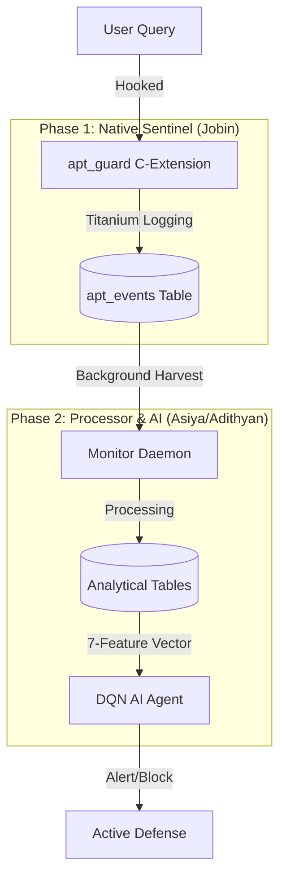

# APT Security System: 5-Minute Review Script

## 📊 System Architecture Flowchart

---

## 🎙️ Part 1: The Native Sentinel (Jobin - 2.5 mins)

**[0:00 - 0:30] Introduction & Problem Statement**
"Good morning, everyone. Our project tackles the detection of Advanced Persistent Threats (APTs) directly within the database engine. Standard logs are easily bypassed, so we built a **Native Sentinel** inside PostgreSQL."

**[0:30 - 1:30] Technical Implementation (apt_guard.c)**
"I developed the `apt_guard` C-extension. It hooks directly into the PostgreSQL [ExecutorEnd](file:///home/jobin/Desktop/IITM/Postgre/src/apt_guard.c#128-186) and [ProcessUtility](file:///home/jobin/Desktop/IITM/Postgre/src/apt_guard.c#187-247) phases. 
Key features:
*   **Titanium Stability**: We use **Internal Subtransactions** to isolate our logging. Even if a logging operation fails, the main database transaction remains untouched—zero downtime for the user.
*   **Forensic Metadata**: For every single query, we capture not just the SQL, but the **User ID**, **Client IP Address**, and **Execution Success/Failure** state."

**[1:30 - 2:30] Analytical Schema & Handover**
"This data is logged into our `apt_events` table, which serves as the 'Single Source of Truth'. This table is specifically designed to feed our new analytical schema, which Asiya will now explain."

---

## 🎙️ Part 2: The Analytical Engine (Asiya - 2.5 mins)

**[2:30 - 3:30] The Automated Pipeline**
"From the raw logs Jobin provides, my focus is on **Behavioral Analysis**. We built an automated 'One-Touch' pipeline in [monitor.py](file:///home/jobin/Desktop/IITM/Postgre/monitor/monitor.py) that runs in the background. 
It continuously 'harvests' raw logs and transforms them into 4 key analytical tables:
1.  **apt_sessions**: Groups queries into behavioral blocks.
2.  **apt_user_profile**: Builds historical baselines for every user.
3.  **apt_sequence_patterns**: Detects dangerous chains of SQL commands."

**[3:30 - 4:30] AI Feature Extraction**
"We reduced the experimental 150-dimension vector into a surgical **7-dimension feature vector**. 
These features (Query Count, Failed Queries, Anomaly Score, etc.) are fed into our **DQN Agent**. This allows the AI to score the threat level of a session in real-time without slowing down the database itself."

**[4:30 - 5:00] Current Status & Q&A**
"As of today, the end-to-end logging and processing pipeline is fully functional in both Docker and Native environments. We are now heading into Phase 2, focusing on retraining the AI model for high-precision detection. 
We'd be happy to take any questions at this time."

---

## 💡 Q&A Cheat Sheet (Preparation)

*   **Q: Why use C-extensions instead of standard audit logs?**
    *   *A: Performance and depth. C-extensions capture internal engine states and forensics that standard logs don't see, and they do it with near-zero latency.*
*   **Q: How do you prevent the extension from crashing the database?**
    *   *A: We use PostgreSQL's `PG_TRY/PG_CATCH` blocks and `BeginInternalSubTransaction`. Our code runs in a sandboxed subtransaction.*
*   **Q: What happens if the AI model is offline?**
    *   *A: The system enters 'Builders-Only' mode. It continues to log and analyze behavioral data (filling all tables), but simply skips the AI-driven active defense.*
